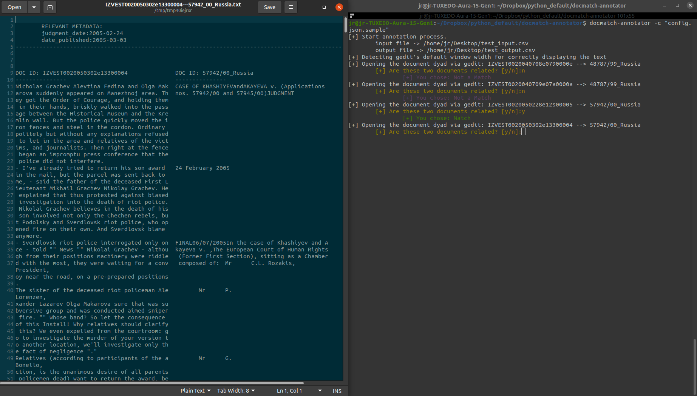

# docmatch-annotator

This is a simple annotation tool for document matching. I wrote this CLI tool to avoid resorting to annotation tools which either have high set up costs or that are more focused in other (more complex) NLP tasks. It uses gedit to display document dyads, a terminal window to annotate whether they match, and that exports the results into a csv file.




 The tool can be configured either via the following command line arguments. 

```bash
usage: domatch_annotator.py [-h] [-i PATH_TO_INPUT_FILE] [-o PATH_TO_OUTPUT_FILE] [-tt TARGET_DOC_TEXT_COLNAME] [-rt REFERENCE_DOC_TEXT_COLNAME]
                            [-ti TARGET_DOC_ID_COLNAME] [-ri REFERENCE_DOC_ID_COLNAME] [-m INCLUDE_METADATA] [-c CONFIG_FILE]

A gedit based annotation tool CLI.

optional arguments:
  -h, --help            show this help message and exit
  -i PATH_TO_INPUT_FILE, --input-csv-file PATH_TO_INPUT_FILE
                        Input csv file containing the documents to annotate.
  -o PATH_TO_OUTPUT_FILE, --output-csv-file PATH_TO_OUTPUT_FILE
                        Output csv file following the annotation
  -tt TARGET_DOC_TEXT_COLNAME, --target-doc-text-colname TARGET_DOC_TEXT_COLNAME
                        Name of the column containing the text of the target document
  -rt REFERENCE_DOC_TEXT_COLNAME, --reference-doc-text-colname REFERENCE_DOC_TEXT_COLNAME
                        Name of the column containing the text of the reference document
  -ti TARGET_DOC_ID_COLNAME, --target-doc-id-colname TARGET_DOC_ID_COLNAME
                        Name of the column containing the id of the target document
  -ri REFERENCE_DOC_ID_COLNAME, --reference-doc-id-colname REFERENCE_DOC_ID_COLNAME
                        Name of the column containing the id of the reference document
  -m INCLUDE_METADATA, --csv-include-metadata INCLUDE_METADATA
                        Comma delimited list of metadata columns from the input file to keep in the output file as well as to display in a different geddit
                        window, e.g. 'date,nchar,language'
  -c CONFIG_FILE, --config-file CONFIG_FILE
                        Output csv file following the annotation
```

Or via a config file saved in a json file like the one below.

```json
{
    "path_to_input_file": "/home/jr/Desktop/test_input.csv",
    "path_to_output_file": "/home/jr/Desktop/test_output.csv",
    "target_doc_text_colname": "leading_paragraph_translated",
    "reference_doc_text_colname": "ruling_text",
    "target_doc_id_colname": "article_id",
    "reference_doc_id_colname": "case_id",
    "include_metadata": [
        "judgment_date",
        "date_published"
    ]
}
```
The path to the config file can be provided via the `-c` flag.


```bash
docmatch_annotator -c "config.json.sample"
```